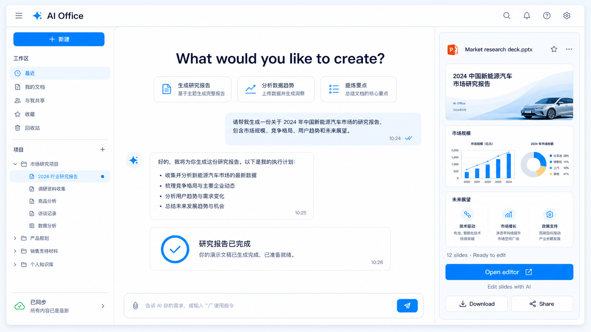
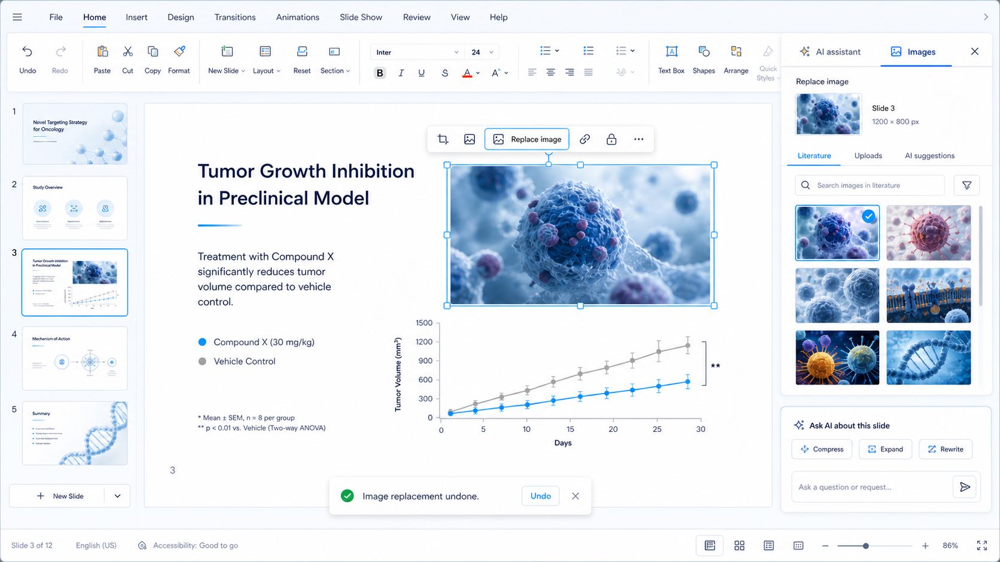

# AI Office

浏览器访问的多租户办公套件 SaaS。文档 / 幻灯片 / 表格 / PDF / Markdown 五大编辑器 + 内置 AI 对话生成与编辑，**编辑引擎全部在浏览器端运行**，后端只做鉴权、存储、模型与搜索代理。

架构参考 [genoffice](https://github.com) 桌面版，弃用 ONLYOFFICE / OpenSandbox 沙箱 / 旧 office-op 桥。实施计划见 [`docs/plan.md`](docs/plan.md)，实现逻辑与 API 见 [`docs/architecture.md`](docs/architecture.md)，部署运维见 [`docs/deploy.md`](docs/deploy.md)。

## 界面预览

 · 

## 功能

- **5 个原生编辑器**：文字（Tiptap + docx-engine）、演示（canvas + pptx-engine）、表格（Univer + Rust xlsx 引擎）、PDF（pdf.js + pdf-lib）、Markdown。
- **AI 对话式生成**：首页一句话生成整套文档/PPT，Agent（ReAct 循环）在浏览器内操作编辑器（块改写、插/改图表、插图、生成整套演示文稿）。
- **模型即插即用**：后端 litellm 代理，10 家 provider（deepseek / claude / openai / google / 阿里 / siliconflow / modelscope / 豆包 / vllm / ollama）。
- **多租户**：注册即建独立组织，数据强隔离；单写锁 + 只读分享 + 版本历史 + 配额限流。
- **原生文件格式**：存储 .docx / .pptx / .xlsx 原文件，改动是窄 patch，版本可回溯。

## 技术栈

| 层 | 技术 |
|---|---|
| 前端 | React + Vite（npm workspaces），Tiptap / Univer / canvas / pdf.js / pdf-lib |
| 后端 | Python 3.13 + FastAPI + SQLAlchemy(async) + litellm + uv |
| 数据 | PostgreSQL（元数据）+ MinIO/S3（blob，本地开发可退化为文件系统） |
| 表格引擎 | Rust sidecar（calamine + ironcalc，NDJSON over stdio） |
| 搜索 | 自建 SearXNG |
| 部署 | docker compose（nginx + backend + postgres + minio），k8s 骨架在 `k8s/` |

## 目录结构

```
├─ frontend/       # 前端 monorepo（apps/* + packages/*，@genoffice/* 保留内部名）
├─ backend/        # FastAPI 薄后端 + xlsx-engine（Rust sidecar 源码）
├─ e2e/            # Playwright 端到端测试
├─ k8s/            # k8s 骨架
├─ docs/           # 文档（architecture / deploy）
├─ start.sh        # 本地开发一键启动
├─ deploy.sh       # 生产 docker compose 部署
├─ docker-compose.yml
└─ docs/plan.md    # 移植实施计划
```

## 快速开始（开发模式）

前置：`uv`、Node ≥ 18。

```bash
cp .env.example .env    # 填 MODEL_PROVIDER/MODEL_NAME + <PROVIDER>_API_KEY，改 JWT_SECRET
./start.sh              # 后端 :8585 + 5 个前端 vite dev
```

启动后访问（需先在文档端注册/登录）：

| 服务 | 地址 |
|---|---|
| 文字（主入口，含登录） | http://localhost:3585 |
| 演示 | http://localhost:3586 |
| PDF | http://localhost:3587 |
| Markdown | http://localhost:3588 |
| 表格 | http://localhost:3589 |
| 后端 API | http://localhost:8585 |

> 注：slides/pdf/markdown/sheets 无独立登录，请先在文档端登录，再经 `?doc=`/首页最近文件打开。表格本地开发需先构建 Rust sidecar：`cd backend/xlsx-engine && cargo build --release`（或设 `XLSX_SIDECAR_BIN`）。

## 生产部署

```bash
cp .env.example .env    # 填模型 key，**必须改 JWT_SECRET**（32+ 随机字节）
./deploy.sh             # docker compose up --build -d，健康检查后输出访问地址
```

或手动：`docker compose up --build -d`。访问 http://localhost/ （MinIO 控制台 :9001，`aioffice / aioffice-secret`）。

`docker-compose.yml` 组成：`frontend`(nginx :80，静态 SPA + API 反代 + SSE)、`backend`(:8585，内部)、`postgres:16`、`minio` + `createbucket`(一次性建桶)。生产 checklist、TLS、托管 PG/S3、水平扩展与 k8s 详见 [`docs/deploy.md`](docs/deploy.md)。

## 配置（.env.example）

| 变量 | 说明 |
|---|---|
| `MODEL_PROVIDER` / `MODEL_NAME` | 模型供应商与模型名（默认 deepseek/deepseek-chat） |
| `<PROVIDER>_API_KEY` | 模型 key（如 `DEEPSEEK_API_KEY`），只存服务端 |
| `JWT_SECRET` | 签发 JWT，生产必改 |
| `SEARXNG_URL` | 自建搜索服务地址，留空禁用搜索 |
| `DATABASE_URL` / `S3_*` | 默认本地 sqlite + 本地文件系统；compose 注入 postgres + minio |
| `MAX_*` / `LOCK_TTL_SEC` / `RATE_LIMIT_*` | 配额/限流（0 关闭） |

## 测试

```bash
cd backend && uv run pytest -q          # 36 passed / 2 skipped（sheets 需先构建 sidecar）
cd frontend && npm test                 # 各 app vitest
cd e2e && npm i && npx playwright install chromium
E2E_BASE_URL=http://localhost:8080 npx playwright test
```

e2e 全部确定性、不调模型。测试栈用 `e2e/serve.py`（stdlib 反代，镜像 nginx 路由）：先构建 5 个 SPA 到 `/tmp/aioffice-web/html`，起后端 :8585，再 `python3 serve.py 8080`——本机 Docker Desktop 不稳时用它代替 compose。

## 开发常见坑

- **Clash 代理**：shell 若设了 `HTTP_PROXY=127.0.0.1:7890`，`curl localhost:XXXX` 会 502。用 `curl --noproxy '*'`；vite dev 只监听 IPv6，用 `http://[::1]:3585/`。
- **端口占用**：`./kill.sh` 一键清理 8585 / 3585-3589。

## 参与贡献

欢迎提交 issue、PR 或功能建议。

```bash
# fork 后本地起环境
cp .env.example .env && ./start.sh

# 改动后端：cd backend && uv run pytest -q
# 改动前端：cd frontend && npm test
# 端到端：见上方「测试」，用 e2e/serve.py 代替 docker compose
```

- 改动范围应贴合 [`docs/plan.md`](docs/plan.md) 的模块边界；本仓库奉行「最小可行」——新增抽象前先看现有代码是否有可复用的。
- 提交前请确保 `tsc --noEmit` / `uv run pytest -q` / `npm test` 通过；涉及 sheets 的测试先构建 Rust sidecar（见「快速开始」）。

## License

[Apache-2.0](https://www.apache.org/licenses/LICENSE-2.0)。项目构建时参考了 genoffice 桌面版（Apache-2.0），本仓库基于 Apache-2.0 分发，保留上游版权与许可；GenOffice / Genspark 商标不属于本项目。
